<!DOCTYPE html>
<html>
<head>
	<link rel="stylesheet" type="text/css" href="https://cdn.jsdelivr.net/npm/bootstrap@5.1.3/dist/css/bootstrap.min.css">
	<link rel="stylesheet" type="text/css" href="Style_galv/Styly.css">
	<link rel="icon" href="icons/favicon.ico" type="image/x-icon">
	<meta charset="utf-8">
	<meta name="viewport" content="width=device-width, initial-scale=1">
	<title>Boucle</title>
</head>
<body>
	<!--Шапка-->
		

		    <header class="d-flex flex-wrap justify-content-center py-3 mb-4 border-bottom">
		      <a href="#" class="d-flex align-items-center mb-3 mb-md-0 me-md-auto text-dark text-decoration-none">
		        <svg class="bi me-2" width="40" height="32"><use xlink:href="#bootstrap"></use></svg>
		        <b>BOUCLE</b>
		      </a>

		      <ul class="nav nav-pills">
		      	<form class="navbar-search pull-left">
  					<input type="text" class="search-query" placeholder="Search">
				</form>
		        <li class="nav-item"><a href="Главная.html" class="nav-link active" aria-current="page">Главная</a></li>
		        <li class="nav-item"><a href="О компании.html" class="nav-link">О нас</a></li>
		        <li class="nav-item"><a href="Партнерам.html" class="nav-link">Для партнеров</a></li>
		        </ul>
		    </header>
	  	

	<!--Меню-->	
	
		

		

			

				

			    	<a href="#" class="d-flex align-items-center mb-3 mb-md-0 me-md-auto link-dark text-decoration-none">
				      <svg class="bi pe-none me-2" width="40" height="32"><use xlink:href="#bootstrap"></use></svg>
				      Товары
				    </a>
				    

				    <ul class="nav nav-pills flex-column mb-auto">
				      <li class="nav-item">
				        <a href="#hats" class="nav-link" aria-current="page">
				          <svg class="bi pe-none me-2" width="16" height="16"><use xlink:href="#home"></use></svg>
				          Шляпки
				        </a>
				      </li>
				      <li>
				        <a href="#hudy" class="nav-link">
				          <svg class="bi pe-none me-2" width="16" height="16"><use xlink:href="#speedometer2"></use></svg>
				          Худи
				        </a>
				      </li>
				      <li>
				        <a href="#svitsh" class="nav-link">
				          <svg class="bi pe-none me-2" width="16" height="16"><use xlink:href="#table"></use></svg>
				          Свитшоты
				        </a>
				      </li>
				      <li>
				        <a href="#keds" class="nav-link">
				          <svg class="bi pe-none me-2" width="16" height="16"><use xlink:href="#grid"></use></svg>
				          Кеды
				        </a>
				      </li>
				      <li>
				        <a href="#bras" class="nav-link">
				          <svg class="bi pe-none me-2" width="16" height="16"><use xlink:href="#people-circle"></use></svg>
				          Браслеты
				        </a>
				      </li>
				    </ul>  
			    
  
			  

			

	<!--Товары-->
			

				
					
					<h2 id="hats">Шляпки</h2>
					

				        

				          

				            <h4 class="my-0 fw-normal">Тип №1</h4>
				          

				          

				          	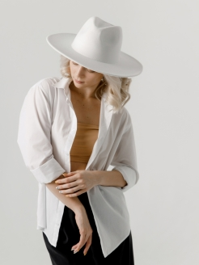
				            <h1 class="card-title pricing-card-title">15$</h1>
				          

				        

				        

				          

				            <h4 class="my-0 fw-normal">Тип №2</h4>
				          

				          

				          	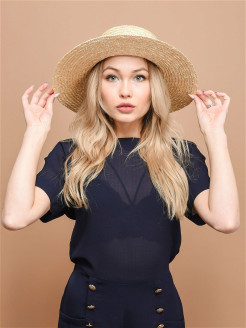
				            <h1 class="card-title pricing-card-title">20$</h1>
				          

				        

				        

				          

				            <h4 class="my-0 fw-normal">Тип №3</h4>
				          

				          

				          	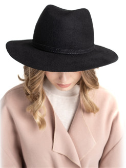
				            <h1 class="card-title pricing-card-title">25$</h1>
				          

				        
			       
			      	

			      	

			      	<h2 id="hudy">Худи</h2>
			      	

				        

				        

				          

				            <h4 class="my-0 fw-normal">Тип №1</h4>
				          

				          

				          	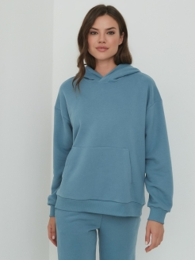
				            <h1 class="card-title pricing-card-title">15$</h1>
				          

				        

				        

				          

				            <h4 class="my-0 fw-normal">Тип №2</h4>
				          

				          

				          	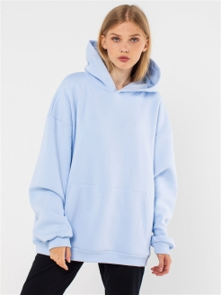
				            <h1 class="card-title pricing-card-title">20$</h1>
				          

				        

				        

				          

				            <h4 class="my-0 fw-normal">Тип №3</h4>
				          

				          

				          	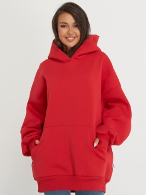
				            <h1 class="card-title pricing-card-title">25$</h1>
				          

				        
			       
			      	
				       
			      	

			      	<h2 id="svitsh">Свитшоты</h2>
			      	

				        

				        

				          

				            <h4 class="my-0 fw-normal">Тип №1</h4>
				          

				          

				          	
				            <h1 class="card-title pricing-card-title">15$</h1>
				          

				        

				        

				          

				            <h4 class="my-0 fw-normal">Тип №2</h4>
				          

				          

				          	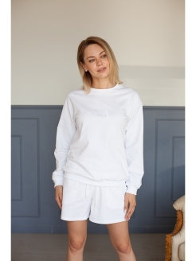
				            <h1 class="card-title pricing-card-title">20$</h1>
				          

				        

				        

				          

				            <h4 class="my-0 fw-normal">Тип №3</h4>
				          

				          

				          	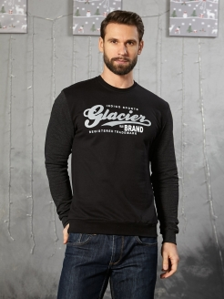
				            <h1 class="card-title pricing-card-title">25$</h1>
				          

				        
			       
			      	
		       
			      	

			      	<h2 id="keds">Кеды</h2>
			      	

				        

				        

				          

				            <h4 class="my-0 fw-normal">Тип №1</h4>
				          

				          

				          	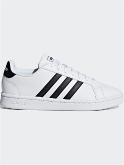
				            <h1 class="card-title pricing-card-title">15$</h1>
				          

				        

				        

				          

				            <h4 class="my-0 fw-normal">Тип №2</h4>
				          

				          

				          	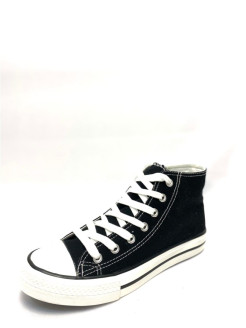
				            <h1 class="card-title pricing-card-title">20$</h1>
				          

				        

				        

				          

				            <h4 class="my-0 fw-normal">Тип №3</h4>
				          

				          

				          	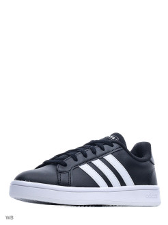
				            <h1 class="card-title pricing-card-title">25$</h1>
				          

				        
			       
			      		
			       
			      	

			      	<h2 id="bras">Браслеты</h2>
			      	

				        

				        

				          

				            <h4 class="my-0 fw-normal">Тип №1</h4>
				          

				          

				          	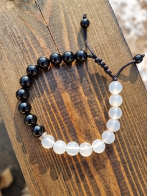
				            <h1 class="card-title pricing-card-title">15$</h1>
				          

				        

				        

				          

				            <h4 class="my-0 fw-normal">Тип №2</h4>
				          

				          

				          	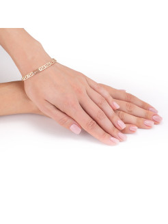
				            <h1 class="card-title pricing-card-title">20$</h1>
				          

				        

				        

				          

				            <h4 class="my-0 fw-normal">Тип №3</h4>
				          

				          

				          	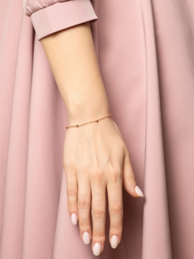
				            <h1 class="card-title pricing-card-title">25$</h1>
				          

				        
			       
			      		

				        
				       
			      	

			  	

			

		

		

	

	<!--Подвал-->
		

		  <footer class="d-flex flex-wrap justify-content-between align-items-center py-3 my-4 border-top">
		    

		      <a href="/" class="mb-3 me-2 mb-md-0 text-muted text-decoration-none lh-1">
		        <svg class="bi" width="30" height="24"><use xlink:href="#bootstrap"></use></svg>
		      </a>
		      © 2022 RossTEAM, Inc
		    

		    <ul class="nav col-md-4 justify-content-end list-unstyled d-flex">
		      <li class="ms-3"></li>
		      <li class="ms-3"></li>
		    </ul>
		  </footer>
		

	
</body>
</html>
